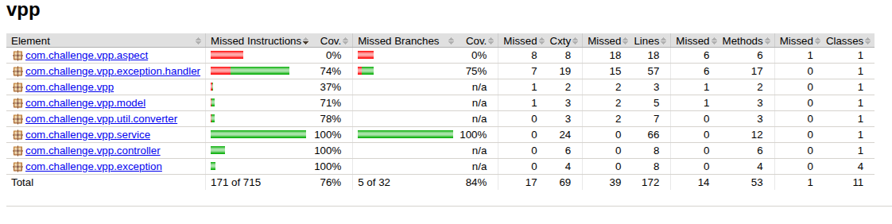

# Virtual Power Plant (VPP)

Virtual Power Plant (VPP) is a Java-based application built using Spring Boot, designed to manage battery-related operations in a distributed energy system. It uses industry-standard frameworks such as Jakarta EE, Spring Data JPA, and PostgreSQL for data persistence, and supports both local and containerized deployments.

---

## Table of Contents
- [Prerequisites](#prerequisites)
- [Technology Stack](#technology-stack)
- [Getting Started](#getting-started)
    - [Run Locally](#run-locally)
    - [Run Using Docker](#run-using-docker)
- [Application Endpoints](#application-endpoints)
- [API Documentation](#api-documentation)
- [Test Coverage](#test-coverage)
- [Future Improvement Scopes](#future-improvement-scopes)

---

## Prerequisites

Ensure you have the following installed:
- Java 21 (Amazon Corretto recommended) [Local]
- Maven 3.9 or newer [Local]
- Docker and Docker Compose [docker based]
- IDE with support for Lombok (e.g., IntelliJ IDEA or Eclipse) [Optional]

---

## Technology Stack

This project uses the following technology stack:
- **Java 21** (Amazon Corretto)
- **Spring Boot** for backend development
- **Jakarta EE** for standardized Java APIs
- **Spring Data JPA** for ORM (Object-Relational Mapping)
- **PostgreSQL** as the database
- **Docker & Docker Compose** for containerization
- **Maven** for build automation
- **GitHub Workflow** for CI/CD and automated testing
- **Swagger / OpenAPI** for API documentation

---

## Getting Started

### Run Locally

To run the application locally:

1. Clone the repository:
   ```bash
   git clone [repository-url]
   cd [project-directory]
   ```

2. Build the application:
   ```bash
   mvn clean install
   ```

3. Set up the PostgreSQL database:
    - Create a database named `vpp` with username `vpp_test_user` and password `vpp_test_pass`.
    - Modify `src/main/resources/application-dev.properties` if needed.

4. Start the application:
   ```bash
   mvn spring-boot:run
   ```

Application will be available at: `http://localhost:8079/vpp`

---

### Run Using Docker

To run with Docker Compose:

1. Clone the repository:
   ```bash
   git clone [repository-url]
   cd [project-directory]
   ```

2. Run the containers:
   ```bash
   docker-compose up -d
   ```

3. Access the application:
    - UI/API: `http://localhost:8079/vpp`
    - Health Check: `http://localhost:8079/vpp/actuator/health`

4. Shut down the containers:
   ```bash
   docker-compose down
   ```

---

## Application Endpoints

Key endpoints:

- **Root API**: `http://localhost:8079/vpp`
- **Health Check**: `http://localhost:8079/vpp/actuator/health`

---

## API Documentation

### Swagger UI
- `http://localhost:8079/vpp/swagger-ui/index.html`

### OpenAPI Specs
- JSON: `http://localhost:8079/vpp/api-docs`
- YAML: `http://localhost:8079/vpp/api-docs.yaml`

### Battery Management API

1. **Add Batteries**
    - Method: `POST /api/v1/batteries`
    - Request body:
      ```json
      {
        "batteries": [
          {
            "name": "string",
            "postcode": 2000,
            "capacity": 500
          }
        ]
      }
      ```

2. **Get Battery Statistics**
    - Method: `GET /api/v1/batteries`
    - Parameters: `from`, `to`, `minCapacity` (optional), `maxCapacity` (optional)

3. **Get Battery by ID**
    - Method: `GET /api/v1/batteries/{id}`

4. **Update Battery**
    - Method: `PUT /api/v1/batteries/{id}`

5. **Delete Battery**
    - Method: `DELETE /api/v1/batteries/{id}`

6. **Paginated Battery List**
    - Method: `GET /api/v1/batteries/all`
    - Supports `Pageable` query parameters

---

## Test Coverage

The project includes comprehensive unit and integration tests using:
- **JUnit 5**
- **Mockito**
- **TestContainer** for jpa repo testing with docker container
- **MockMvc** for controller-level testing

Test classes ensure coverage of:
- Valid and invalid input handling
- Exception propagation
- Endpoint behaviors
- Response validations

To run tests:
```bash
mvn clean test
```

Test reports can be viewed via `target/site/jacoco/index.html`.

The current code base test coverage is `76%`



---

## Future Improvement Scopes

- Add JWT-based authentication and role-based access control
- Integrate with OAuth2 providers (e.g., Google, GitHub)
- Implement rate limiting and IP throttling
- Introduce Redis caching for frequently accessed data
- Use asynchronous processing for heavy operations
- Support horizontal scaling via Kubernetes

